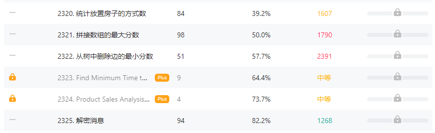

### LeetCode刷题助手

该仓库是一个Chrome插件，主要用来辅助刷题，整个插件一共有两个功能，下面分别介绍

##### 功能一. 每次打开LeetCode的时候会随机从自己收藏的题目里面抽取一道，作为LeetCode每日一题的补充，并展示在每日一题的上面

##### 功能二、给题目标上具体的难度分数，而不是使用三个等级（简单、中等、困难）

该功能依托与零神的一个项目，[传送门](https://github.com/zerotrac/leetcode_problem_rating)

**注意：这里有些题目没有分数，仍使用的是LeetCode本身就有的等级**

